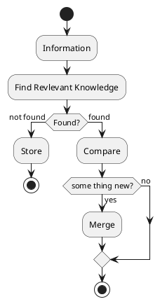

# Second Brain

第二大脑解决的是人类对知识的管理和存储问题。原因是人类的大脑是有缺陷的，人类一直在用一个学习模型进行存储、检索，其实是一种对资源的浪费，而且其实也并不能优秀的完成这项任务。

大脑的主要问题在于大脑并不是一个合适的存储介质。如果存储过多信息，并且不会遗忘的话，大脑的学习过程就会变得非常缓慢。遗忘过多的话又会造成积累困难。

所以合理的组织文档，使其成为第二大脑，可以补足大脑的缺陷，让学习、工作、生活变得更加轻松。

但第二大脑也存在一定的问题，就是你需要花费大量的时间来维护这些信息，就像邓布利多经常出现在冥想盆前一样，你需要管理你的知识以保证第二大脑的正确使用。

整体流程：
- 信息收集：收集你接触到的信息，并将其记录下来；
- 信息提取：提取知识库中已经存在的相关信息，作为补充参考；
- 信息整合：将新的信息与已有的知识库进行整合，去伪存真，甚至进行扩展；
- 信息存储：将整合后的信息存储在知识库中。

